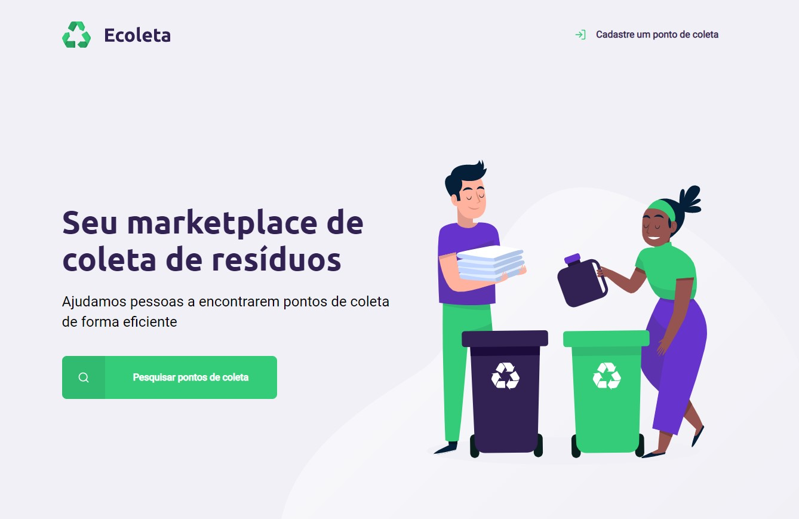

<h1 align="center">
    
</h1>

# NWL-1

## :calendar: Days

Dia 1: Acelerando sua evolução 01/06 - ✔️

Dia 2: Olhando para as oportunidades 02/06 - ✔️

Dia 3: A escolha da Stack 03/06 - ✔️

Dia 4: Até 2 anos em 2 meses 04/06 - ✔️

Dia 5: Milha extra 05/06 - ✔️

## :wrench: Project

The "Ecoleta" website was created because of the international environment week, the objective was to connect people and recycling companies,
so the collection of specific wastes, such as cooking oil, batteries and lamps could be more easy.

<h1 align="center">
    
</h1>

## :rocket: Technologies

- [Node.js][nodejs]
- [JavaScript][javascript]
- [HTML][html]
- [CSS][css]

[nodejs]: https://nodejs.org/
[javascript]: https://developer.mozilla.org/en-US/docs/Web/JavaScript
[html]: https://developer.mozilla.org/en-US/docs/Web/HTML
[css]: https://developer.mozilla.org/en-US/docs/Web/CSS
